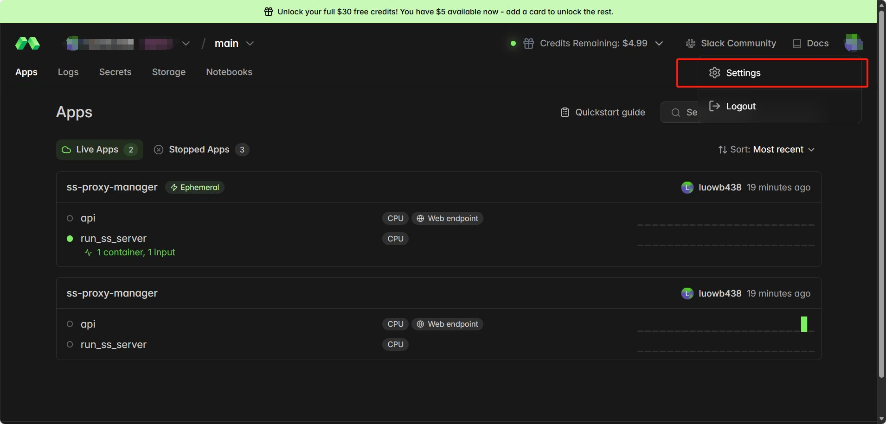
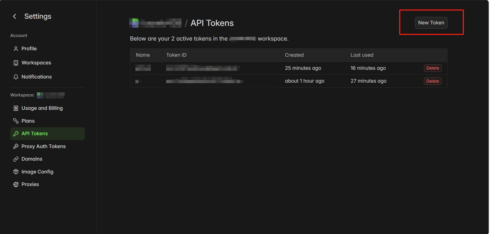

# 🚀 完全免费 Shadowsocks 代理搭建指南

基于 [Modal](https://modal.com) 云平台 + GitHub Actions 自动运行的免费 Shadowsocks 代理方案。

出口 IP 为日本东京（Google Cloud），适合日常使用。

---

## ✅ 优点

- **完全免费**：Modal 免费额度充足，流量无需花钱，5美刀额度，一个月大约可以使用 **26 天**左右
- **无需服务器**：不用买 VPS，全部跑在云平台上
- **一键部署**：GitHub Actions 自动运行，每天定时重启
- **日本节点**：出口 IP 为日本东京，延迟低、速度可观
- **订阅链接**：支持 Clash 订阅和 SS 链接，主流客户端通用

## ⚠️ 缺点

- **每日需手动更新配置**：每次重启后隧道地址会变，需要在 Clash 客户端手动刷新/更新订阅配置文件
- **非 7×24 稳定**：受 Modal 免费额度和 24 小时超时限制，偶尔会断线（小概率，断线了手动重启即可）
---

## 📋 前置条件

| 需要准备的 | 说明 |
|-----------|------|
| [Modal 账号](https://modal.com) | 免费注册，每月有免费额度 |
| [GitHub 账号](https://github.com) | 用于自动运行代理服务 |
| 代理客户端 | Clash / ClashX / Shadowrocket / v2rayN 等 |

---

## 🛠️ 搭建步骤

### 第一步：注册 Modal 并获取 Token

1. 打开 https://modal.com ，注册并登录
2. 点击右上角头像 → **Settings**



3. 左侧选择 **API Tokens** → 点击右上角 **New Token**



4. 创建后会显示 `Token ID` 和 `Token Secret`，**立即复制保存**（只显示一次）


---

### 第二步：创建 GitHub 私有仓库

1. 在 GitHub 新建一个 **私有仓库**（Private），名字随意，例如 `my-proxy`
2. 把以下两个文件放进仓库：

#### 📄 `ssnew3.py`（代理主程序）

把提供的 `ssnew3.py` 文件放到仓库根目录。

> ⚠️ 建议修改文件中的 `password = "123456"` 为一个强密码，防止被别人扫到盗用。

#### 📄 `.github/workflows/ss-proxy.yml`（自动运行配置）

在仓库中创建 `.github/workflows/` 目录，新建 `ss-proxy.yml` 文件，内容如下：

```yaml
name: SS Proxy

on:
  workflow_dispatch:
  schedule:
    - cron: '0 0 * * *'

jobs:
  run-proxy:
    runs-on: ubuntu-latest

    steps:
      - uses: actions/checkout@v4

      - uses: actions/setup-python@v5
        with:
          python-version: '3.11'

      - name: Install dependencies
        run: pip install modal pyyaml fastapi uvicorn

      - name: Deploy API
        env:
          MODAL_TOKEN_ID: ${{ secrets.MODAL_TOKEN_ID }}
          MODAL_TOKEN_SECRET: ${{ secrets.MODAL_TOKEN_SECRET }}
        run: modal deploy ssnew3.py

      - name: Start SS Server (detached)
        timeout-minutes: 2
        env:
          MODAL_TOKEN_ID: ${{ secrets.MODAL_TOKEN_ID }}
          MODAL_TOKEN_SECRET: ${{ secrets.MODAL_TOKEN_SECRET }}
        run: modal run --detach ssnew3.py
```

---

### 第三步：配置 GitHub Secrets

1. 进入你的仓库 → **Settings** → **Secrets and variables** → **Actions**
2. 点击 **New repository secret**，添加两个密钥：

   | Name | Value |
   |------|-------|
   | `MODAL_TOKEN_ID` | 第一步获取的 `ak-xxx` |
   | `MODAL_TOKEN_SECRET` | 第一步获取的 `as-xxx` |

---

### 第四步：启动代理

1. 进入仓库 → **Actions** → 左侧选择 **SS Proxy**
2. 点击右侧 **Run workflow** → **Run workflow**
3. 等待约 1 分钟，工作流运行完成（绿色 ✅）

---

### 第五步：获取代理配置

部署成功后，打开以下地址（替换 `你的workspace` 为你的 Modal 用户名）：

| 地址 | 用途 |
|------|------|
| `https://你的workspace--ss-api.modal.run/` | 查看代理状态 |
| `https://你的workspace--ss-api.modal.run/clash` | Clash 订阅地址 |
| `https://你的workspace--ss-api.modal.run/ss` | 获取 SS 链接 |

> 💡 不确定你的 workspace 名？登录 https://modal.com/apps 查看。

---

## 📱 客户端配置

### Clash / ClashX / Clash Verge

1. 打开 Clash → **配置/Profiles**
2. 输入订阅地址：`https://你的workspace--ss-api.modal.run/clash`
3. 下载配置并选中
4. 打开系统代理，选择 **Global Selection** 分组

### Shadowrocket（iOS）

1. 打开 Shadowrocket
2. 访问 `https://你的workspace--ss-api.modal.run/ss`
3. 复制返回的 `ss://...` 链接
4. 回到 Shadowrocket，会自动识别并添加节点

### v2rayN（Windows）

1. 访问 `https://你的workspace--ss-api.modal.run/ss`
2. 复制 `ss://...` 链接
3. v2rayN → **服务器** → **从剪贴板导入**

---

## 🔄 日常使用

| 场景 | 操作 |
|------|------|
| 正常使用 | 什么都不用管，GitHub Actions 每天自动重启 |
| 代理断了 | 去 GitHub Actions 手动点一次 Run workflow |
| 每日更新 | 每天在 Clash 客户端点击**更新订阅**刷新配置 |
| 换密码 | 修改 `ssnew3.py` 中的 `password`，推送后重新运行 |
| 查看状态 | 访问 `/` 端点或 Modal 控制台 |

---

## ⚠️ 注意事项

1. **务必用私有仓库**，否则密码和配置会泄露
2. **Modal 免费额度有限**，留意用量，避免产生费用
3. **每次重启后隧道地址会变**，需要在客户端刷新订阅（Clash 订阅链接本身不变，点更新即可拿到新地址）
4. **密码请改成复杂的**，`123456` 容易被扫描盗用
5. **仅供学习和个人使用**，请遵守当地法律法规

---

## 🏗️ 架构说明

```
GitHub Actions (每天定时触发 / 手动触发)
    │
    ├── modal deploy  → 部署 API 端点（提供订阅链接）
    └── modal run --detach  → 启动 SS 服务器（后台运行最多 24h）
            │
            ├── ss-server (Shadowsocks 服务)
            └── modal.forward() (TCP 隧道，日本东京出口)

用户客户端 ──→ Modal TCP 隧道 ──→ ss-server ──→ 互联网
```

---

## 🐛 常见问题

**Q: 订阅地址返回 "No active proxy"？**
> SS 服务器还没启动或已超时停止。去 GitHub Actions 重新运行一次 workflow。

**Q: 连上了但是网速很慢？**
> Modal 免费实例资源有限，高峰期可能较慢，属于正常现象。

**Q: 如何查看 Modal 用量？**
> 登录 https://modal.com → 左侧 Usage 页面查看。

**Q: GitHub Actions 没有自动运行？**
> 如果仓库 60 天没有活动，GitHub 会自动禁用 scheduled workflows。进仓库 Actions 页面手动启用即可。

**Q: 每天都要手动操作吗？**
> 不需要。GitHub Actions 每天自动重启 SS 服务器。你只需要在 Clash 客户端**更新一下订阅**就能拿到最新的服务器地址。
